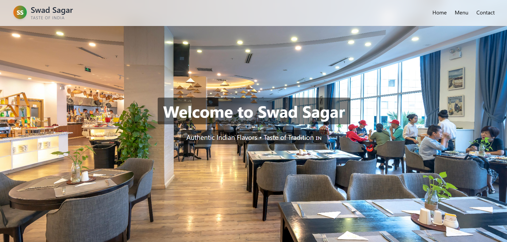
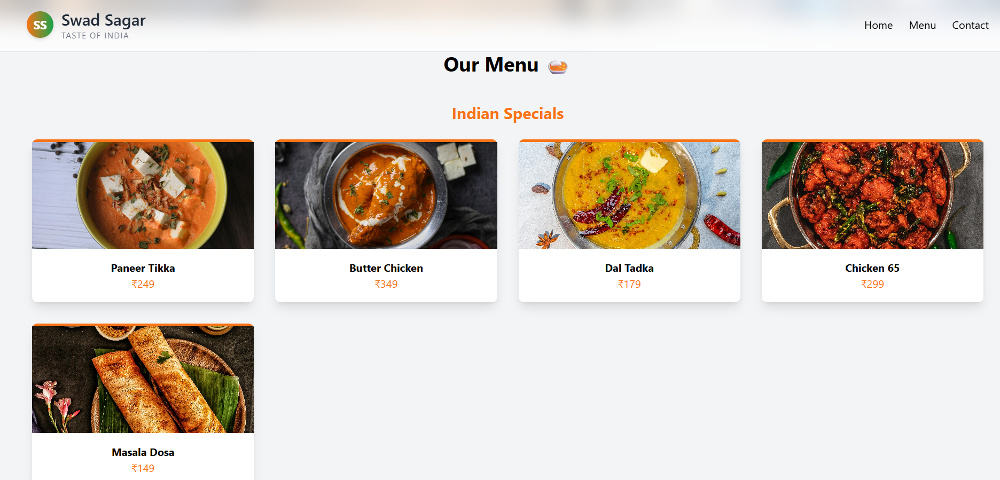
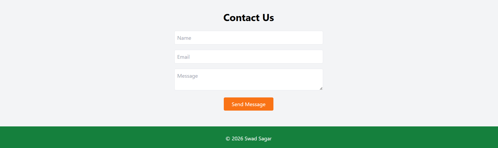

# 🍽️ Swad Sagar – Restaurant Website

A modern and responsive restaurant website built using React and Tailwind CSS with smooth animations.

---

## 🚀 Live Demo
🌐 https://future-fs-03-two-zeta.vercel.app/

---

## 📌 Features

✔ Responsive restaurant UI  
✔ Animated sections using Framer Motion  
✔ Food menu with multiple categories:
   - Indian dishes (Paneer, Butter Chicken, Dal Tadka, etc.)
   - Breads (Roti, Chapati)
   - Fast food (Pizza, Burger, Pasta)
   - Beverages (Mango, Strawberry, Orange Juice, Soft Drinks)
✔ Contact form with EmailJS integration  
✔ WhatsApp contact button  
✔ Scroll progress indicator  
✔ Loader animation  

---

## 🛠️ Tech Stack

- React.js  
- Tailwind CSS  
- Framer Motion  
- EmailJS  

---

## 📸 Screenshots

### 🏠 Homepage


### 🍛 Menu


### 📞 Contact


---

## ⚙️ Installation

```bash
git clone https://github.com/yourusername/FUTURE_FS_03.git
cd FUTURE_FS_03/client
npm install
npm start
